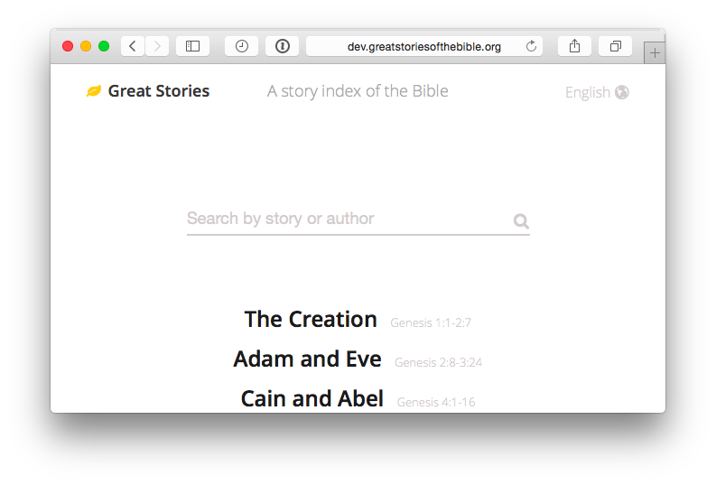
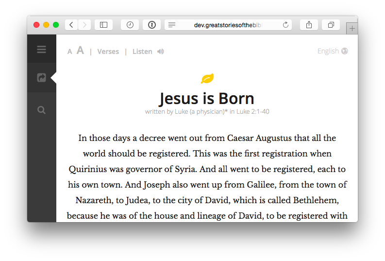

# Great Stories of the Bible

Have you seen someone share a Bible verse? Probably. Have you seen someone share an entire Bible story? Probably not. Why is this? We share links to long form articles everyday. It’s the relationship we have to linking to a chunk of text vs linking to a story. We share verses as an intellectual exercise, but the Bible is about people and God, characters and their relationships.

[Great Stories](http://greatstories.org) presents the bible as short stories. Jump in, read a story and share it.

Live at:

* http://greatstoriesofthebible.org/
* http://greatstoriesofthebible.cn/

#### Code for the Kingdom

Great Stories was an entry at the [Code for the Kingdom](http://codeforthekingdom.org/) Hackathon, 2014 in Redwood City, that won a runner up prize.

See the pitch at [youtube.com/watch?v=rbaMSLCMbrg](https://www.youtube.com/watch?v=rbaMSLCMbrg).

------

Created by [Leigh McCulloch](https://leighmcculloch.com). Design by [Jason Burkholder](http://jtburkholder.com/).

Thanks to the Tyndale House Publishing Inc. for permission to freely
republish the "Great Stories of the Bible" index, which is found in many
publishings of the New Living Translation Bibles. 

The index used contains minor alterations and was taken specifically
from the Tyndale House Publishing Inc.'s NLT Compact Edition, New Living
Translation's Second Edition Bible.  
ISBN-13: 978-1-4143-0232-4  
ISBN-10: 1-4143-0232-0

Thanks to Crossway (esvapi.org), Bibles.org, and the Digital Bible Platform for supplying bible text and audio in numerous languages via their respective APIs.
