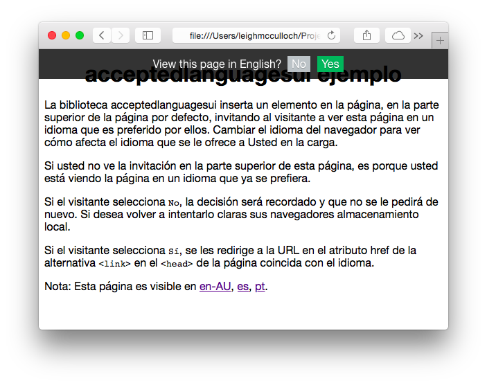

# acceptedlanguagesui.js

[](https://travis-ci.org/leighmcculloch/acceptedlanguagesui.js)

A simple JavaScript library that asks the visitor if they'd like to view the current page in one of it's alternate languages, if the their browser indicates another language is preferred.

This library does not translate your website, but offers the alternate versions of your website, as defined by `<link rel="alternate" hreflang="es" href="..." />` tags in the `<head>` of your web page. See the usage below for an example.

Uses [acceptedlanguages.js](https://github.com/leighmcculloch/acceptedlanguages.js) to discover the users accepted languages and the pages alternate languages.

## Why

Language dropdowns are often placed below the fold or in inconspicuous locations of a web page. Including this library into a web page invites the visitor to switch quickly to their preferred language without requiring them to discover the language drop down.

## Example

See the [example](example/).



## Install

### Bower

```bash
bower install acceptedlangaugesui
```

### NPM

```bash
npm install acceptedlanguagesui --save
```

### Manual

Download [acceptedlanguages.min.js](https://github.com/leighmcculloch/acceptedlanguages.js/blob/master/dist/acceptedlanguages.min.js) and [acceptedlanguagesui.min.js](dist/acceptedlanguagesui.min.js).

## Usage

### Globals

Include `acceptedlanguages.js` and `acceptedlanguagesui.js` into the page and call `init`.

```html
<html lang="en">
  <head>
    <link rel="alternate" hreflang="pt-BR" href="..." />
    <link rel="alternate" hreflang="es" href="..." />
    <link rel="alternate" hreflang="en" href="..." />
    <script src="acceptedlanguages.js"></script>
    <script src="acceptedlanguagesui.js"></script>
    <script type="text/javascript">
      window.onload = function() {
        acceptedlanguagesui.init();
      };
    </script>
  </head>
  <body>
  </body>
</html>
```

If the visitor is viewing the `en` version of the page, and the browser is configured with the languages `pt, zh-Hans, en-US`, they will be offered to switch to `pt-BR`.

### RequireJS

Include the library and then use as a dependency:

```javascript
define(['acceptedlanguagesui'], function(acceptedLanguagesUI) {
  acceptedlanguagesui.display();
});
```

## Browser Compatibility

All browsers supporting ECMAScript 5: Chrome, Safari, Firefox, IE9, etc. If you need to support older browsers use [es5-shims](https://github.com/es-shims/es5-shim) to get the following:
* `Array.forEach`
* `Array.filter`
* `Array.map`
